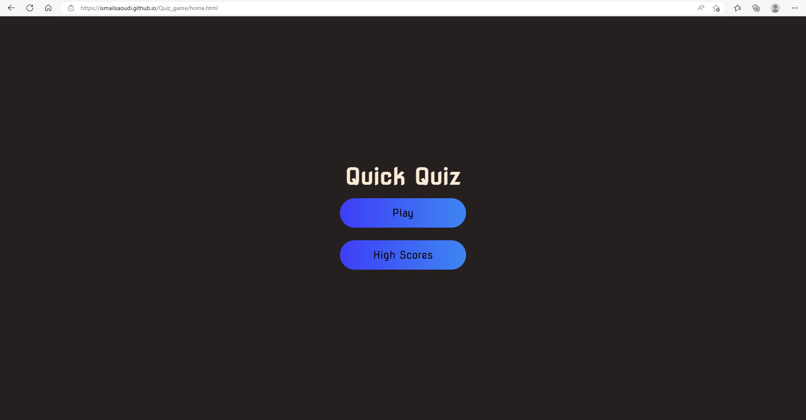
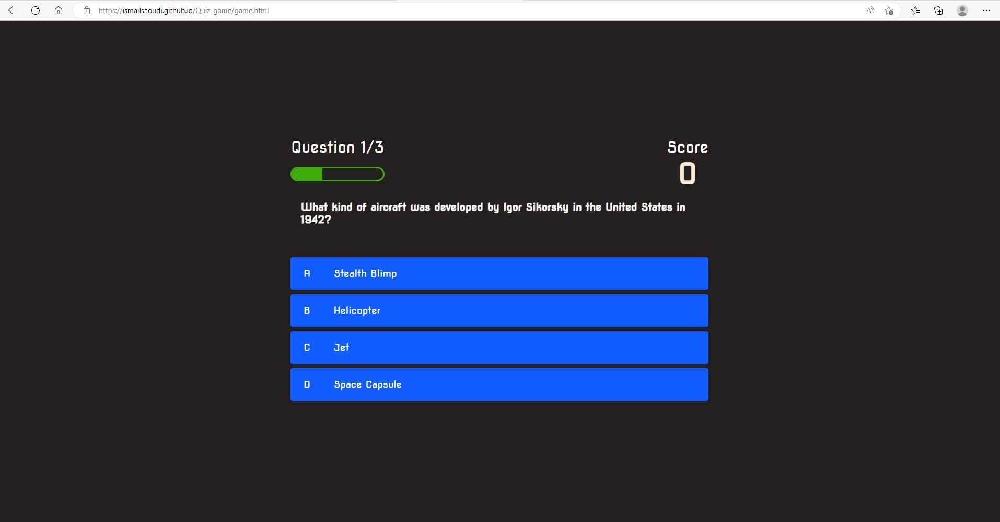
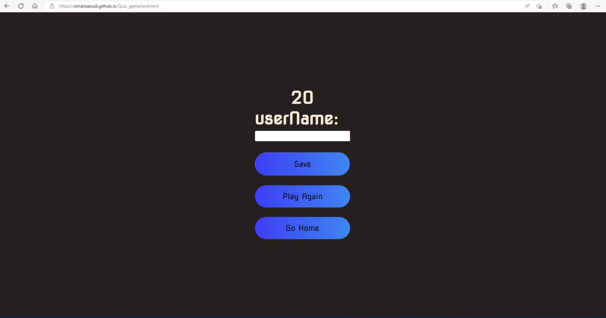
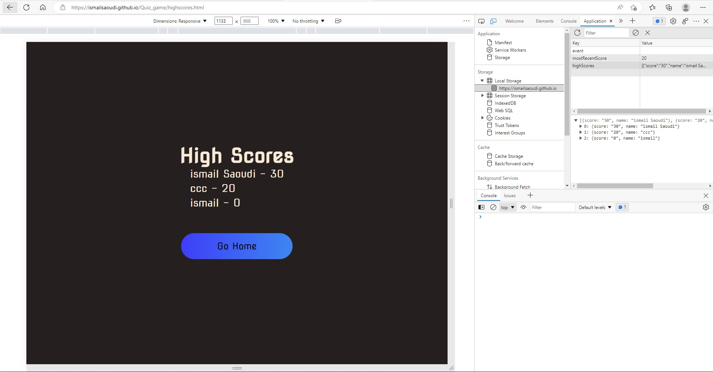

# Quiz Game

A responsive website where you can play quiz games based on the difficulty simply by logging in.
Only by opening the link, the user will be able to get access of the game. the questions will be generatated randomly from a trivia API
after answering the questions the User will be prompted to a a save session to enter his user name. all saved scores will be help on the highscores page afterward 

## Tools Used:-
1. HTML
2. CSS
3. JavaScript 
4. Trivia web API
 

## Table of Contents (Optional)

- [Installation](#installation)
- [Usage](#usage)
- [Credits](#credits)
- [License](#license)
- [Features](#features)

## Installation

For installtion of this application, you would require a text editor. Visual Studio Code is the recommended application. 

## Usage

## Credits

Ismail Saoudi - developed the application with the help of the 3rd party API TRIVIA

## License

---

## Features

* Four separate pages with homepage acting as a directory and an extra layer of user interaction that allow the users to choose which page to view first. 
* Home Page to ask you if you would like to play 
* game Page showing all the questions and answers to be selected 
* End Page to save your score into local storage
* High score Page to show users scores from high to low
* local storage functions are able to store each username and Scores made
